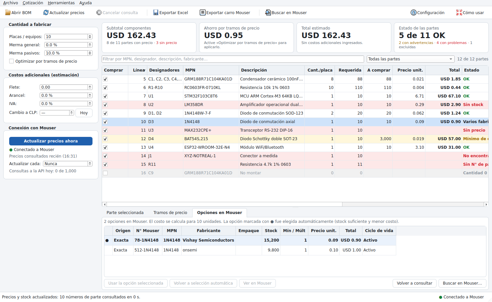

# MouserEngine – Cotizador de BOM con Mouser

Aplicación de escritorio para cotizar un BOM (lista de materiales) con **precios y stock en tiempo real**
desde la API de Mouser. Carga el BOM en Excel o CSV, busca cada parte en Mouser, aplica los tramos de
precio, el mínimo de compra y el múltiplo de venta, y muestra el costo total para la cantidad de placas
que va a fabricar.


*Captura con el BOM de ejemplo (`ejemplos/bom_ejemplo.csv`) y datos de prueba.*

## Qué hace

- **Carga del BOM** desde Excel (`.xlsx`) o CSV (coma o punto y coma), con detección automática de la
  hoja, la fila de encabezados y las columnas. Reconoce las columnas habituales de Altium, KiCad, Eagle,
  JLCPCB, Digi-Key y Mouser, y también encabezados en español. Se puede arrastrar el archivo a la ventana.
- **Consulta en vivo a Mouser**:
  - busca por MPN o por código Mouser, agrupando hasta 10 partes por consulta;
  - indica el estado de la conexión y cuántas consultas lleva hoy;
  - se puede actualizar con F5 o automáticamente cada N minutos.
- **Cálculo en tiempo real**: al cambiar el número de placas, la merma o cualquier cantidad, los totales
  se recalculan al instante sin volver a consultar la API.
- **Selección automática de la mejor opción**: cuando un MPN tiene varias presentaciones o fabricantes
  en Mouser, elige la que tiene stock suficiente y el menor costo total. Por ejemplo, cinta cortada para
  pocas unidades y carrete completo cuando conviene. Siempre se puede elegir otra opción a mano.
- **Alertas** en cada línea:
  - sin stock o stock insuficiente, con plazo de fábrica y unidades en pedido;
  - parte obsoleta, en fin de vida o no recomendada para diseños nuevos (NRND), con el reemplazo que
    sugiere Mouser;
  - no encontrada (con sugerencias), fabricante distinto al del BOM o varios fabricantes posibles;
  - mínimo de compra alto.
- **Optimización por tramos de precio**: avisa (o aplica) cuando comprar unas unidades más baja el
  total. Por ejemplo, 100 unidades pueden costar menos que 88.
- **Búsqueda en Mouser** por palabras clave para asignar una parte a las líneas sin número de parte o
  no encontradas.
- **Costos adicionales (estimación)**: flete, arancel e IVA, y conversión a pesos chilenos con el dólar
  observado del día (Banco Central de Chile, vía mindicador.cl).
- **Exportación**:
  - **Excel** con resumen, detalle, problemas, carro y BOM original;
  - **CSV del carro** con código Mouser y cantidad, para cargar en mouser.com.



## Instalación en Windows

1. Descargue `MouserEngine.exe` desde la pestaña **Actions** del repositorio: abra la última ejecución
   de «Pruebas y compilación» y descargue el artefacto *MouserEngine-windows*. Si existe un *Release*,
   también está disponible ahí.
2. Copie el archivo donde quiera, por ejemplo al escritorio, y ábralo. No requiere instalación.
   - La primera vez Windows SmartScreen puede advertir que la aplicación no está firmada. Elija
     «Más información» y luego «Ejecutar de todas formas».
3. Para tener un acceso directo en el escritorio use **Herramientas → Crear acceso directo en el
   escritorio**.

También puede ejecutarla desde el código fuente con `iniciar_windows.bat`, que requiere Python 3.10 o
superior. La primera vez crea un entorno virtual e instala las dependencias. Para generar el `.exe`
localmente use `compilar_windows.bat`.

En Linux y macOS: `./iniciar.sh`.

## Configurar la API key

1. En [mouser.com](https://www.mouser.com), entre a **My Mouser → APIs** y solicite una clave de la
   **Search API**. La clave de *Cart/Order API* es distinta y no sirve para consultar precios.
2. En MouserEngine abra **Herramientas → Configuración**, pegue la clave y pruebe la conexión.

La clave se guarda solo en su computador y nunca en el repositorio:

| Sistema | Ubicación |
| --- | --- |
| Windows | `%APPDATA%\MouserEngine\config.json` |
| macOS | `~/Library/Application Support/MouserEngine/config.json` |
| Linux | `~/.config/MouserEngine/config.json` |

También se puede entregar con la variable de entorno `MOUSER_API_KEY`, que tiene prioridad.

La moneda de los precios es la de su cuenta de Mouser; se muestra en la primera consulta.

## Uso

1. **Abrir BOM**: revise las columnas detectadas en la vista previa y presione «Importar». Las líneas
   con el mismo número de parte se agrupan en una sola compra. Las líneas con cantidad 0 quedan excluidas
   (no montar).
2. **Cantidad a fabricar**: número de placas y merma.
   - La merma de pasivos reemplaza a la general para resistencias, condensadores, inductores y ferritas.
3. **Revise las alertas**: filtre por «Con problemas» y use la pestaña **Opciones en Mouser** o
   **Buscar en Mouser** para corregir.
4. **Exporte** la cotización a Excel o el carro en CSV.

En la tabla se pueden editar directamente estos campos; al cambiar un MPN se vuelve a consultar solo
esa parte:
- la cantidad por placa;
- el MPN;
- el código Mouser;
- el fabricante.

Con clic derecho sobre el encabezado se eligen las columnas visibles.

### Límites de la API

Mouser permite hasta 1.000 consultas diarias por API key y del orden de 30 por minuto. Cada consulta
cubre hasta 10 números de parte, así que un BOM de 200 líneas usa unas 20 consultas. La aplicación
respeta el límite por minuto automáticamente y muestra las consultas del día en el panel izquierdo.

### Qué no incluye el total

El subtotal corresponde solo a los componentes, según Mouser en el momento de la consulta. Flete,
arancel e IVA son estimaciones con los valores que usted ingrese. Precios y stock pueden cambiar entre
la cotización y la compra.

## Desarrollo

```bash
python -m venv .venv
.venv/bin/pip install -r requirements-dev.txt     # Windows: .venv\Scripts\pip ...
QT_QPA_PLATFORM=offscreen .venv/bin/pytest -q      # pruebas (sin conexión: usan un servidor simulado de Mouser)
.venv/bin/python -m mouser_engine                  # abrir la aplicación
.venv/bin/python tools/screenshots.py capturas     # capturas de la interfaz con datos de prueba
.venv/bin/pyinstaller --noconfirm --clean MouserEngine.spec   # ejecutable en dist/
```

La integración continua (`.github/workflows/build.yml`) ejecuta las pruebas en Linux y Windows, compila
`MouserEngine.exe`, lo verifica con `--self-test` y lo publica como artefacto. Al crear un tag `v*` lo
adjunta a un Release.

### Estructura

| Archivo | Contenido |
| --- | --- |
| `mouser_engine/mouser_api.py` | Cliente de la Mouser Search API: lotes, límite de consultas, reintentos y errores |
| `mouser_engine/bom.py` | Lectura de CSV/Excel, detección de columnas y consolidación de líneas |
| `mouser_engine/pricing.py` | Cantidades de compra (mínimo/múltiplo) y tramos de precio |
| `mouser_engine/quote.py` | Selección de la mejor opción, estados y totales |
| `mouser_engine/export.py` | Excel de cotización y CSV del carro |
| `mouser_engine/gui/` | Interfaz (PySide6/Qt) |
| `tests/` | Pruebas, con `fake_mouser.py` como servidor simulado de la API |
