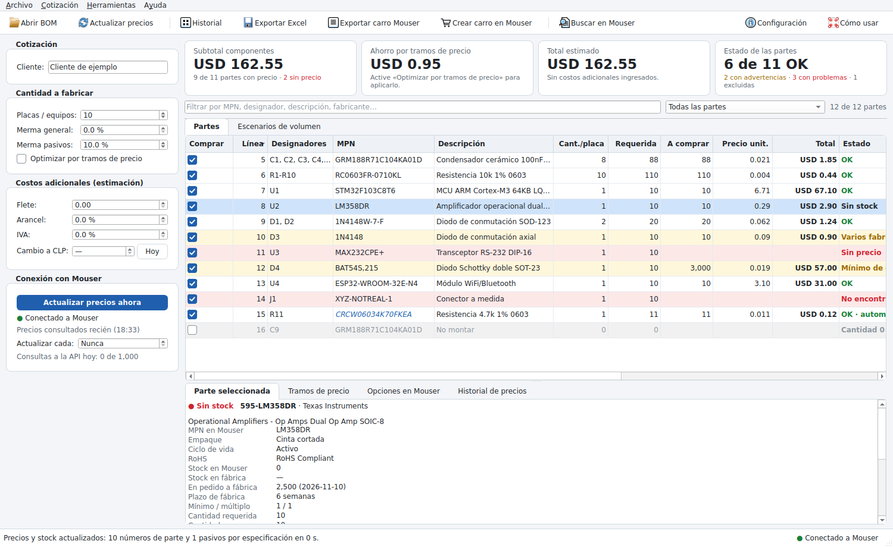
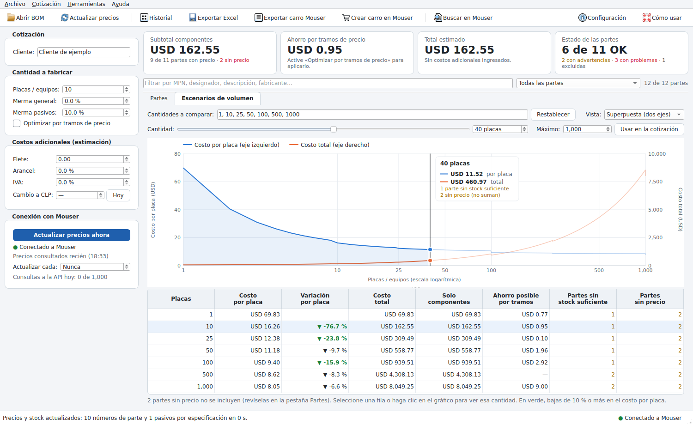
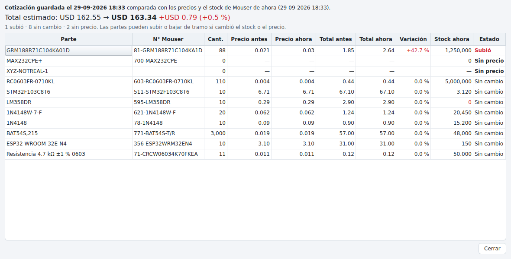
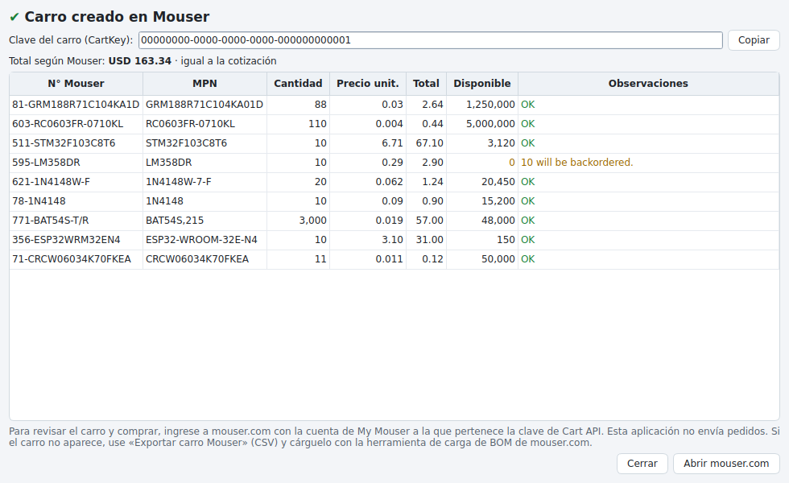

# MouserEngine – Cotizador de BOM con Mouser

Aplicación de escritorio para cotizar un BOM (lista de materiales) con **precios y stock en tiempo real**
desde la API de Mouser. Carga el BOM en Excel o CSV, busca cada parte en Mouser, aplica los tramos de
precio, el mínimo de compra y el múltiplo de venta, y muestra el costo total para la cantidad de placas
que va a fabricar.



*Captura con el BOM de ejemplo (`ejemplos/bom_ejemplo.csv`) y datos de prueba.*

**Descarga directa (Windows):**
[MouserEngine.exe](https://github.com/DataRF/MouserEngine/releases/latest/download/MouserEngine.exe)
(siempre la última versión publicada).

## Qué hace

- **Carga del BOM** desde Excel (`.xlsx`) o CSV (coma o punto y coma):
  - detecta sola la hoja, la fila de encabezados y las columnas;
  - reconoce los BOM de Fusion 360/Eagle, Altium Designer, KiCad, JLCPCB, Digi-Key y Mouser, y también
    planillas armadas a mano con encabezados en español;
  - se puede arrastrar el archivo a la ventana.
- **Consulta en vivo a Mouser**:
  - busca por MPN o por código Mouser, agrupando hasta 10 partes por consulta;
  - indica el estado de la conexión y cuántas consultas lleva hoy;
  - se puede actualizar con F5 o automáticamente cada N minutos.
- **Cálculo en tiempo real**: al cambiar el número de placas, la merma o cualquier cantidad, los totales
  se recalculan al instante sin volver a consultar la API.
- **Selección automática de la mejor opción**: cuando un MPN tiene varias presentaciones o fabricantes
  en Mouser, elige la que tiene stock suficiente y el menor costo total. Por ejemplo, cinta cortada para
  pocas unidades y carrete completo cuando conviene. Siempre se puede elegir otra opción a mano.
- **Resistencias y condensadores sin MPN**: lee del BOM el valor, encapsulado, tolerancia, potencia,
  tensión y dieléctrico, busca en Mouser y elige la opción más conveniente que **cumple o supera** cada
  especificación, prefiriendo **fabricantes reconocidos** (Yageo, Vishay, Panasonic, KOA, Murata, TDK,
  Samsung, KEMET, etc.). Lo que el BOM no indica se completa con valores configurables (por ejemplo,
  tolerancia 5 % y tensión mínima 16 V) y la línea queda marcada para revisar.
- **Escenarios de volumen**: costo por placa y costo total para 1, 10, 25, 50, 100, 500 y 1.000 placas
  (cantidades editables). Una barra de cantidad recorre el gráfico de costo por placa y de costo total, y
  la tabla destaca en verde las bajas de 10 % o más.
- **Alertas** en cada línea:
  - sin stock o stock insuficiente, con plazo de fábrica y unidades en pedido;
  - parte obsoleta, en fin de vida o no recomendada para diseños nuevos (NRND), con el reemplazo que
    sugiere Mouser;
  - no encontrada (con sugerencias), fabricante distinto al del BOM o varios fabricantes posibles;
  - mínimo de compra alto.
- **Optimización por tramos de precio**: avisa (o aplica) cuando comprar unas unidades más baja el
  total. Por ejemplo, 100 unidades pueden costar menos que 88.
- **Búsqueda en Mouser** por palabras clave para asignar una parte a las líneas sin número de parte o
  no encontradas.
- **Costos adicionales (estimación)**: flete, arancel e IVA, y conversión a pesos chilenos con el dólar
  observado del día (Banco Central de Chile, vía mindicador.cl).
- **Carro en Mouser**: crea el carro directamente en su cuenta de Mouser con la Cart API. La aplicación
  **solo crea el carro; nunca envía pedidos**. La compra se revisa y se confirma en mouser.com.
- **Historial en este computador**: guarda cada cotización con sus precios y stock para reabrirla,
  compararla con los precios de hoy o exportarla. Muestra además la evolución del precio de cada parte.
- **Exportación**:
  - **Excel** con resumen (empresa y cliente), escenarios de volumen con gráficos, detalle, problemas,
    carro y BOM original;
  - **CSV del carro** con código Mouser, cantidad y referencia, para cargar en mouser.com.



## Instalación en Windows

1. Descargue
   [MouserEngine.exe](https://github.com/DataRF/MouserEngine/releases/latest/download/MouserEngine.exe)
   (también está en la página de *Releases* del repositorio).
2. Copie el archivo donde quiera, por ejemplo al escritorio, y ábralo. No requiere instalación.
   - La primera vez Windows SmartScreen puede advertir que la aplicación no está firmada. Elija
     «Más información» y luego «Ejecutar de todas formas».
3. Para tener un acceso directo en el escritorio use **Herramientas → Crear acceso directo en el
   escritorio**.

Para actualizar, descargue de nuevo el archivo desde el mismo enlace y reemplace el anterior. La
configuración y el historial se conservan.

También puede ejecutarla desde el código fuente con `iniciar_windows.bat`, que requiere Python 3.10 o
superior. La primera vez crea un entorno virtual e instala las dependencias. Para generar el `.exe`
localmente use `compilar_windows.bat`.

En Linux y macOS: `./iniciar.sh`.

## Configurar las claves de la API

En [mouser.com](https://www.mouser.com), entre a **My Mouser → APIs**. Mouser entrega dos claves
distintas, y cada una se autoriza por separado:

| Clave | Para qué se usa | Dónde se ingresa |
| --- | --- | --- |
| **Search API** («Buscar API») | Precios y stock (obligatoria) | Configuración → API de Mouser → Search API |
| **Cart/Order API** | Crear el carro en Mouser (opcional) | Configuración → API de Mouser → Cart API |

Use «Probar conexión» para validar la clave de la Search API. Mientras Mouser tenga una clave como
«Pendiente», las funciones que la usan no estarán disponibles.

Las claves se guardan solo en su computador y nunca en el repositorio:

| Sistema | Ubicación |
| --- | --- |
| Windows | `%APPDATA%\MouserEngine\config.json` |
| macOS | `~/Library/Application Support/MouserEngine/config.json` |
| Linux | `~/.config/MouserEngine/config.json` |

También se pueden entregar con las variables de entorno `MOUSER_API_KEY` y `MOUSER_CART_API_KEY`, que
tienen prioridad.

La moneda de los precios es la de su cuenta de Mouser; se muestra en la primera consulta.

## Uso

1. **Abrir BOM**: revise las columnas detectadas en la vista previa y presione «Importar». Las líneas
   con el mismo número de parte, o los pasivos con la misma especificación, se agrupan en una sola
   compra. Las líneas con cantidad 0 quedan excluidas (no montar).
2. **Cotización**: ingrese el cliente (la empresa para la que se diseña), el número de placas y la merma.
   - La merma de pasivos reemplaza a la general para resistencias, condensadores, inductores y ferritas.
3. **Revise las alertas**: filtre por «Con problemas» y use la pestaña **Opciones en Mouser** o
   **Buscar en Mouser** para corregir.
4. **Escenarios de volumen**: mueva la barra de cantidad o haga clic en el gráfico. «Usar en la
   cotización» lleva esa cantidad al campo de placas. La vista «Separada» muestra dos gráficos.
5. **Guarde, exporte o cree el carro**:
   - **Ctrl+S** guarda la cotización en el historial; exportar a Excel y crear el carro también la
     guardan;
   - **Crear carro en Mouser** muestra lo que se enviará, pide confirmación y entrega la clave del carro
     (CartKey) con el precio que confirmó Mouser para cada ítem.

En la tabla se pueden editar directamente estos campos; al cambiar un MPN se vuelve a consultar solo
esa parte:
- la cantidad por placa;
- el MPN;
- el código Mouser;
- el fabricante.

Con clic derecho sobre el encabezado se eligen las columnas visibles.

### Historial

El historial se guarda en `historial.sqlite3`, en la misma carpeta que la configuración. En
**Historial** (Ctrl+H) se puede:

- **abrir** una cotización con los precios y el stock de ese momento;
- **comparar con precios actuales**: vuelve a consultar Mouser y muestra qué partes subieron, bajaron o
  quedaron sin precio;
- **exportar** a Excel una cotización guardada;
- **eliminar** registros.

La pestaña **Historial de precios** del panel inferior muestra cómo cambió el precio y el stock de la
parte seleccionada en las cotizaciones guardadas.



### Carro en Mouser

- Se crea un carro **nuevo** en cada uso. Como referencia de cada ítem se guardan los designadores
  (hasta 21 caracteres, límite de Mouser).
- Mouser acepta hasta 100 ítems por solicitud y 399 por carro. La aplicación envía los lotes necesarios.
- Las partes sin precio o sin código Mouser no se incluyen; la confirmación indica cuáles son.
- Para revisar el carro y comprar, ingrese a mouser.com con la cuenta de My Mouser a la que pertenece la
  clave de Cart API. Si el carro no aparece, use «Exportar carro Mouser» (CSV) y cárguelo con la
  herramienta de carga de BOM de mouser.com.



### Límites de la API

Mouser permite hasta 1.000 consultas diarias por API key y del orden de 30 por minuto. Cada consulta
cubre hasta 10 números de parte, así que un BOM de 200 líneas usa unas 20 consultas. Los pasivos sin MPN
usan entre 1 y 3 consultas por especificación distinta. La aplicación respeta el límite por minuto
automáticamente y muestra las consultas del día en el panel izquierdo.

### Qué no incluye el total

El subtotal corresponde solo a los componentes, según Mouser en el momento de la consulta. Flete,
arancel e IVA son estimaciones con los valores que usted ingrese. Precios y stock pueden cambiar entre
la cotización y la compra; al crear el carro, Mouser confirma el precio de cada ítem.

## Desarrollo

```bash
python -m venv .venv
.venv/bin/pip install -r requirements-dev.txt     # Windows: .venv\Scripts\pip ...
QT_QPA_PLATFORM=offscreen .venv/bin/pytest -q      # pruebas (sin conexión: usan un servidor simulado de Mouser)
.venv/bin/python -m mouser_engine                  # abrir la aplicación
.venv/bin/python tools/screenshots.py capturas     # capturas de la interfaz con datos de prueba
.venv/bin/pyinstaller --noconfirm --clean MouserEngine.spec   # ejecutable en dist/
```

La integración continua (`.github/workflows/build.yml`) ejecuta las pruebas en Linux y Windows, compila
`MouserEngine.exe`, lo verifica con `--self-test` y lo publica como artefacto. Al crear un tag `v*` lo
adjunta a un Release, que queda disponible en el enlace de descarga directa.

### Estructura

| Archivo | Contenido |
| --- | --- |
| `mouser_engine/mouser_api.py` | Cliente de la Mouser Search API y de la Cart API (solo creación de carros): lotes, límite de consultas, reintentos y errores |
| `mouser_engine/bom.py` | Lectura de CSV/Excel, detección de columnas y consolidación de líneas |
| `mouser_engine/passives.py` | Especificación de resistencias y condensadores: lectura del BOM, del MPN y de la descripción de Mouser, y evaluación «cumple o supera» |
| `mouser_engine/lookup.py` | Consulta completa del BOM: números de parte y pasivos por especificación |
| `mouser_engine/pricing.py` | Cantidades de compra (mínimo/múltiplo) y tramos de precio |
| `mouser_engine/quote.py` | Selección de la mejor opción, estados y totales |
| `mouser_engine/scenarios.py` | Escenarios de volumen y curva de costo por cantidad |
| `mouser_engine/cart.py` | Líneas del carro y referencias para Mouser |
| `mouser_engine/history.py` | Historial local (SQLite), historial de precios y comparación |
| `mouser_engine/export.py` | Excel de cotización y CSV del carro |
| `mouser_engine/gui/` | Interfaz (PySide6/Qt) |
| `tests/` | Pruebas, con `fake_mouser.py` como servidor simulado de la API |
